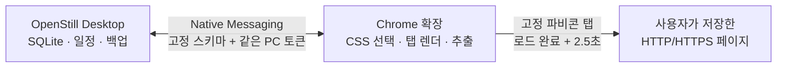

# OpenStill

OpenStill은 사용자가 지정한 웹페이지와 CSS 선택자의 변화를 로컬에서 예약 확인하는 Manifest V3 Chrome 확장 프로그램입니다. 선택·실제 렌더링·추출은 Chrome 확장이 맡고, 일정·결과·백업은 선택적으로 같은 PC의 Python 기반 OpenStill Desktop Companion이 보관합니다.

## 핵심 기능

- 한 URL에 최대 20개 CSS 선택자를 하나의 추적으로 저장하고, 중복 없는 DOM 순서 목록으로 비교
- top-level 페이지가 완전히 로드된 뒤 **최소 2.5초**를 기다려 선택기 좌표와 예약 추출 결과를 안정화
- 예약 확인 중인 탭을 맨 왼쪽의 **고정 파비콘 전용 탭**으로 비활성 상태에서 잠시 열고, 확인이 끝나면 닫음
- 카드별 체크박스, 현재 필터 전체 선택, 선택한 수백 개 추적의 일괄 확인 및 진행·오류 요약
- 1시간~14일 주기, 변경 알림, 알림음, 라벨·상태·검색 필터, 줄/단어 단위 diff
- `openstill-selector-draft` v1 JSON을 클립보드에 복사: Desktop이 꺼져 있어도 CSS 선택 후 나중에 붙여넣어 등록 가능
- `openstill-export` v2 JSON 가져오기/내보내기: 최대 1,000개 추적과 32 MB 파일 지원

## 구성과 실행 흐름



Desktop의 일정이 기준입니다. Chrome과 확장이 켜져 있을 때 확장이 Desktop의 due-job 큐를 가져와 실제 웹페이지를 열고 결과를 돌려줍니다. Chrome이 꺼진 동안에는 Desktop이 모니터마다 하나의 보류 작업만 유지하므로 과거 실행이 대량으로 쌓이지 않습니다.

## 로컬 확장 설치

1. Chrome에서 `chrome://extensions`를 엽니다.
2. **개발자 모드**를 켭니다.
3. **압축해제된 확장 프로그램을 로드합니다**를 눌러 이 저장소 루트를 선택합니다.
4. HTTP/HTTPS 페이지에서 OpenStill 아이콘을 누르고 **이 페이지에서 요소 선택**을 시작합니다.
5. 원하는 요소를 고른 뒤 이름·라벨·간격을 정하고 저장합니다.

OpenStill은 설치 시 HTTP/HTTPS 전체 사이트 접근 권한을 요청합니다. 이는 사용자가 가져온 수백 개의 임의 도메인을 도메인별 권한 대화상자 없이 예약 확인하기 위해서입니다. 실제로 열고 읽는 대상은 사용자가 저장하거나 가져온 URL과 그 추적에 설정된 CSS 선택자에 한정됩니다.

## OpenStill Desktop Companion

Desktop은 표준 라이브러리 Python 코드와 Windows PyInstaller `onedir` 빌드 스크립트를 포함합니다.

```powershell
./desktop/build-onedir.ps1
./desktop/register-native-host.ps1 -ExtensionId YOUR_32_CHARACTER_EXTENSION_ID
```

빌드 결과는 다음과 같습니다.

- `desktop/dist/OpenStillDesktop/OpenStillDesktop.exe` — 로컬 대시보드와 SQLite 저장소
- `desktop/dist/OpenStillNativeHost/OpenStillNativeHost.exe` — Chrome Native Messaging host

Desktop EXE를 실행하면 `http://127.0.0.1:8765/`가 열리고 연결 토큰이 표시됩니다. 확장 관리 화면의 **Desktop** 버튼에서 그 토큰을 붙여넣으면 연결됩니다. Desktop SQLite의 웹사이트 콘텐츠 payload와 연결 토큰은 현재 Windows 사용자에 묶인 DPAPI로 보호됩니다. 상세 설치·백업·복원·보안 설명은 [desktop/README.md](desktop/README.md)를 참고하세요.

## 권한

| 권한 | 용도 |
| --- | --- |
| `activeTab`, `scripting` | 사용자가 요청한 현재 탭의 CSS 선택기 |
| required `http://*/*`, `https://*/*` | 저장/가져온 임의 HTTP·HTTPS URL의 예약 확인 |
| `storage`, `unlimitedStorage` | 실행용 브라우저 캐시와 수백 개 스냅샷 |
| `alarms`, `notifications` | Chrome가 켜진 동안의 예약 확인과 변경 알림 |
| `offscreen`, `clipboardWrite` | 선택자 문법 검증, 로컬 알림음, 선택 초안 복사 |
| `nativeMessaging` | 같은 PC의 OpenStill Desktop SQLite·일정 연동 |

OpenStill은 `tabs`, `cookies`, `history`, `webRequest`, `downloads`, `contextMenus`, `all_frames`, 원격 JavaScript/Wasm을 사용하지 않습니다. 쿠키·비밀번호·인증 헤더를 읽거나 로그인·페이월·CAPTCHA를 우회하지 않습니다.

## 데이터와 한계

- URL, 페이지 제목, CSS 선택자, 선택한 요소 텍스트, 일정, 상태는 브라우저 실행용 캐시와 선택적으로 같은 PC의 Desktop SQLite에만 저장됩니다. 개발자나 제3자 서버로 전송하지 않습니다.
- closed Shadow DOM과 cross-origin iframe 내부는 표준 CSS 선택자로 추적할 수 없습니다.
- 페이지가 계속 변하는 SPA는 로드 뒤 2.5초보다 더 기다릴 수 있지만, 그보다 이르게 추출하지 않습니다.
- Chrome/확장이 종료되면 웹페이지 확인은 실행되지 않습니다. Desktop은 다음 연결 시 모니터별로 한 번만 보류된 확인을 전달합니다.
- 새 컴퓨터로 이동할 때는 Desktop 백업 JSON을 가져오고 Chrome의 사이트 권한은 다시 승인해야 합니다.

## Chrome Web Store 준비

- [STORE_SUBMISSION.md](STORE_SUBMISSION.md)에 광범위 HTTP/HTTPS 권한과 Native Messaging의 심사용 한국어/영어 사유를 정리했습니다.
- [PRIVACY.md](PRIVACY.md)를 공개 URL에 게시하고 Store의 Privacy practices를 실제 동작과 동일하게 작성하세요.
- Store ZIP에는 확장 파일만 넣습니다. `desktop/`, `References/`, 테스트, 문서는 포함하지 않습니다.
- `./package-release.ps1`는 Store 업로드용 ZIP을 만들며 Desktop Companion은 별도 설치 파일/배포본으로 제공합니다.
