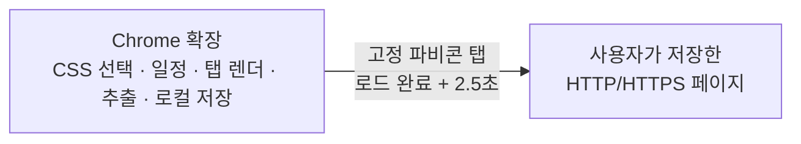

# OpenStill

OpenStill은 사용자가 지정한 웹페이지와 CSS 선택자의 변화를 브라우저 로컬에서 확인하는 Manifest V3 Chrome 확장 프로그램입니다. 선택, 실제 렌더링, 일정, 결과, 백업은 모두 확장 프로그램과 Chrome 로컬 저장소에서 처리합니다.

## 핵심 기능

- 한 URL에 최대 20개 typed locator(CSS, Shadow DOM용 XCSS, XPath, include/exclude, 속성·프로퍼티 필드)를 하나의 추적으로 저장하고, 중복 없는 결과 목록으로 비교
- 리스트·래퍼 변경에 덜 흔들리는 SelectorX가 `:first-child`, 의미 있는 class/attribute 부분 일치, 형제 관계를 조합해 CSS/XCSS를 생성
- 정규식 후처리, 렌더링 추가 대기·최대 캡처 시간, 텍스트/HTML·링크 비교, 공백 무시, 빈 결과 처리, 인라인 스타일·스크립트·HTML 주석 포함을 추적별로 설정
- 변경 다이얼로그에서 안전한 HTTP(S) 링크를 클릭하고, 기준/변경 이력·실행 이력과 선택 실패 당시의 정제된 화면 증거를 확인
- 열어 둔 동일 URL 탭에는 선택적으로 MutationObserver 기반 실시간 감시를 연결하며, 실제 캡처·비교는 예약 확인과 같은 경로를 사용
- top-level 페이지가 완전히 로드된 뒤 **최소 2.5초**를 기다려 선택기 좌표와 예약 추출 결과를 안정화
- 예약 확인 중인 탭을 맨 왼쪽의 **고정 파비콘 전용 탭**으로 비활성 상태에서 잠시 열고, 확인이 끝나면 닫음
- 카드별 체크박스, 현재 필터 전체 선택, 선택한 수백 개 추적의 일괄 확인 및 진행·오류 요약
- 기본값인 **수동** 확인과 1시간~14일 자동 주기, 변경 알림, 알림음, 라벨·상태·검색 필터, 줄/단어 단위 diff
- 대시보드의 **주소 일괄 변경**: 도메인(필요하면 포트) 단위로 여러 추적의 주소를 옮기며, 프로토콜·경로·쿼리·확인 방식과 기존 스냅샷·변경·실행 기록을 유지하고 대상 페이지 충돌 시 전체 변경을 안전하게 취소
- 마지막 읽은 시간·확인한 시간·변경된 시간·이름 기준의 오름차순/내림차순 실시간 정렬
- `openstill-export` v4 JSON 가져오기/내보내기(v2·v3도 호환): 최대 5,000개 추적, 파일 선택 상한 없음(브라우저 자원 범위 내). 내보내기는 32 MB 미만의 번호가 붙은 JSON 파일로 분할하며, 새 백업은 part별 체크섬과 전체 part·추적 수를 함께 기록해 누락·중복·혼합·손상을 저장 전에 확인. 큰 단일 추적도 JSON 조각으로 나누어 여러 파일을 한 번에 불러올 수 있음(조각이 있는 경우 모든 part를 함께 선택)
- 200개 이상 가져오기·내보내기·대시보드 목록 표시는 100개 단위로 양보 처리하며 진행도를 표시하고, JSON 읽기 단계의 바이트 진행과 해석 상태는 별도 워커에서 안내

## 구성과 실행 흐름

자동 확인을 켠 추적은 Chrome과 확장이 실행 중일 때 다음 확인 시각에 처리합니다. 수동 추적은 자동으로 갱신하지 않으며, 대시보드의 **지금 확인**으로만 기준값과 변경을 확인합니다.

## 로컬 확장 설치

1. https://github.com/tchinso/OpenStill/releases/ 에서 확장프로그램을 다운로드 합니다.(Source Code.zip)
2. 적당한 경로에 압축을 풉니다.
3. Chrome에서 `chrome://extensions`를 엽니다.
4. **개발자 모드**를 켭니다.
5. **압축해제된 확장 프로그램을 로드합니다**를 눌러 압축이 풀린 저장소의 루트를 선택합니다.
6. HTTP/HTTPS 페이지에서 OpenStill 아이콘을 누르고 **이 페이지에서 요소 선택**을 시작합니다.
7. 원하는 요소를 고른 뒤 이름·라벨·확인 방식을 정하고 저장합니다.

OpenStill은 설치 시 HTTP/HTTPS 전체 사이트 접근 권한을 요청합니다. 이는 사용자가 가져온 수백 개의 임의 도메인을 도메인별 권한 대화상자 없이 예약 확인하기 위해서입니다. 실제로 열고 읽는 대상은 사용자가 저장하거나 가져온 URL과 그 추적에 설정된 CSS 선택자에 한정됩니다.

## 권한

| 권한 | 용도 |
| --- | --- |
| `activeTab`, `scripting` | 사용자가 요청한 현재 탭의 CSS 선택기 |
| required `http://*/*`, `https://*/*` | 저장/가져온 임의 HTTP·HTTPS URL의 예약 확인 |
| `storage`, `unlimitedStorage` | 브라우저 로컬 추적 데이터와 수백 개 스냅샷 |
| `alarms`, `notifications` | Chrome가 켜진 동안의 자동 확인과 변경 알림 |
| `offscreen` | 선택자 문법 검증과 로컬 알림음 |
| `webNavigation` | 사용자가 저장한 하위 프레임 locator를 해당 프레임에만 실행하고, 새로고침 뒤에도 URL 기반 frame 경로로 다시 식별 |
| `tabs` | 사용자가 실시간 감시를 요청했을 때, 이미 열어 둔 동일 URL 탭만 찾아 연결 |
| `downloads` | 사용자가 요청한 분할 JSON 백업 파일을 저장하고, 그 파일의 완료·실패만 확인 |

OpenStill은 `downloads`를 사용자가 요청한 분할 JSON 백업 파일의 저장과 그 파일의 완료·실패 처리에만 사용하며, 기존 다운로드 목록을 조회하거나 저장하지 않습니다. `cookies`, `history`, `webRequest`, `contextMenus`, 원격 JavaScript/Wasm은 사용하지 않습니다. `tabs` 권한은 실시간 감시를 위해 열린 탭의 URL 메타데이터를 일시적으로 저장 URL과 대조하는 데만 쓰며, 일치하지 않는 탭의 DOM·콘텐츠를 읽거나 저장하지 않습니다. 선택기는 저장 대상 페이지의 접근 가능한 프레임에만 패키지의 고정 스크립트를 주입합니다. 쿠키·비밀번호·인증 헤더를 읽거나 로그인·페이월·CAPTCHA를 우회하지 않습니다.

## 데이터와 한계

- URL, 페이지 제목, typed locator, 필터된 HTML·텍스트 스냅샷, 변경·실행 이력, 선택 실패 증거, 일정, 상태는 Chrome 로컬 저장소에만 저장됩니다. 개발자나 제3자 서버로 전송하지 않습니다.
- 대시보드에서 사용자가 명시적으로 내보내거나 가져오는 JSON 파일로만 데이터를 백업·복원할 수 있습니다.
- 내보내기 전체 용량과 선택 파일의 앱 내 상한은 없지만, 생성되는 각 백업 파일은 32 MB 미만입니다. 단일 파일 읽기와 JSON 해석에는 브라우저 메모리가 필요하므로, 외부에서 만든 매우 큰 JSON은 Chrome 자원 한계에 따라 실패할 수 있습니다.
- 새 형식의 분할 백업은 마지막 part까지 한 세트로 선택해야 하며, 하나라도 빠졌거나 같은 part를 중복 선택하면 기존 데이터에 반영하지 않습니다. 이전 OpenStill v4 백업도 계속 읽을 수 있지만, 당시 파일에는 마지막 part 표시와 체크섬이 없어 마지막 파일 누락까지 완전히 증명할 수는 없습니다.
- Shadow DOM은 XCSS locator로, 접근 가능한 iframe은 frame locator로 추적할 수 있습니다. 브라우저가 스크립트 주입을 허용하지 않는 sandboxed·보호 프레임은 변경으로 오인하지 않고 확인 오류로 표시됩니다.
- 실시간 감시는 사용자가 대시보드에서 연결을 누른, 이미 열려 있는 동일 URL 탭에서만 동작합니다. 탭을 닫거나 페이지를 이동하면 예약/수동 확인은 계속 가능하지만 실시간 관찰은 종료됩니다.
- 페이지가 계속 변하는 SPA는 로드 뒤 2.5초보다 더 기다릴 수 있지만, 그보다 이르게 추출하지 않습니다.
- Chrome/확장이 종료되면 웹페이지 확인은 실행되지 않습니다.
