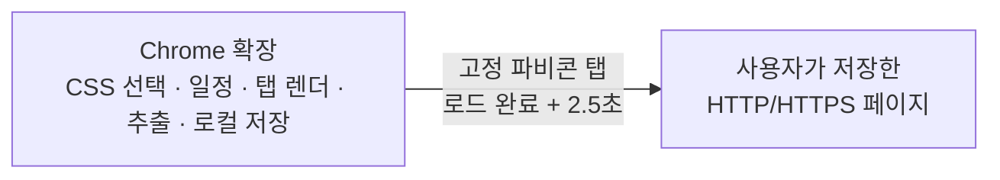

# OpenStill

OpenStill은 사용자가 지정한 웹페이지와 CSS 선택자의 변화를 브라우저 로컬에서 확인하는 Manifest V3 Chrome 확장 프로그램입니다. 선택, 실제 렌더링, 일정, 결과, 백업은 모두 확장 프로그램과 Chrome 로컬 저장소에서 처리합니다.

## 핵심 기능

- 한 URL에 최대 20개 CSS 선택자를 하나의 추적으로 저장하고, 중복 없는 DOM 순서 목록으로 비교
- top-level 페이지가 완전히 로드된 뒤 **최소 2.5초**를 기다려 선택기 좌표와 예약 추출 결과를 안정화
- 예약 확인 중인 탭을 맨 왼쪽의 **고정 파비콘 전용 탭**으로 비활성 상태에서 잠시 열고, 확인이 끝나면 닫음
- 카드별 체크박스, 현재 필터 전체 선택, 선택한 수백 개 추적의 일괄 확인 및 진행·오류 요약
- 기본값인 **수동** 확인과 1시간~14일 자동 주기, 변경 알림, 알림음, 라벨·상태·검색 필터, 줄/단어 단위 diff
- 대시보드의 **주소 일괄 변경**: 도메인(필요하면 포트) 단위로 여러 추적의 주소를 옮기며, 프로토콜·경로·쿼리·확인 방식은 유지하고 대상 페이지 충돌 시 전체 변경을 안전하게 취소
- `openstill-export` v2 JSON 가져오기/내보내기: 최대 1,000개 추적과 32 MB 파일 지원

## 구성과 실행 흐름

자동 확인을 켠 추적은 Chrome과 확장이 실행 중일 때 다음 확인 시각에 처리합니다. 수동 추적은 자동으로 갱신하지 않으며, 대시보드의 **지금 확인**으로만 기준값과 변경을 확인합니다.

## 로컬 확장 설치

1. Chrome에서 `chrome://extensions`를 엽니다.
2. **개발자 모드**를 켭니다.
3. **압축해제된 확장 프로그램을 로드합니다**를 눌러 이 저장소 루트를 선택합니다.
4. HTTP/HTTPS 페이지에서 OpenStill 아이콘을 누르고 **이 페이지에서 요소 선택**을 시작합니다.
5. 원하는 요소를 고른 뒤 이름·라벨·확인 방식을 정하고 저장합니다.

OpenStill은 설치 시 HTTP/HTTPS 전체 사이트 접근 권한을 요청합니다. 이는 사용자가 가져온 수백 개의 임의 도메인을 도메인별 권한 대화상자 없이 예약 확인하기 위해서입니다. 실제로 열고 읽는 대상은 사용자가 저장하거나 가져온 URL과 그 추적에 설정된 CSS 선택자에 한정됩니다.

## 권한

| 권한 | 용도 |
| --- | --- |
| `activeTab`, `scripting` | 사용자가 요청한 현재 탭의 CSS 선택기 |
| required `http://*/*`, `https://*/*` | 저장/가져온 임의 HTTP·HTTPS URL의 예약 확인 |
| `storage`, `unlimitedStorage` | 브라우저 로컬 추적 데이터와 수백 개 스냅샷 |
| `alarms`, `notifications` | Chrome가 켜진 동안의 자동 확인과 변경 알림 |
| `offscreen` | 선택자 문법 검증과 로컬 알림음 |

OpenStill은 `tabs`, `cookies`, `history`, `webRequest`, `downloads`, `contextMenus`, `all_frames`, 원격 JavaScript/Wasm을 사용하지 않습니다. 쿠키·비밀번호·인증 헤더를 읽거나 로그인·페이월·CAPTCHA를 우회하지 않습니다.

## 데이터와 한계

- URL, 페이지 제목, CSS 선택자, 선택한 요소 텍스트, 일정, 상태는 Chrome 로컬 저장소에만 저장됩니다. 개발자나 제3자 서버로 전송하지 않습니다.
- 대시보드에서 사용자가 명시적으로 내보내거나 가져오는 JSON 파일로만 데이터를 백업·복원할 수 있습니다.
- 열린/닫힌 Shadow DOM과 cross-origin iframe 내부는 표준 CSS 선택자로 추적할 수 없습니다.
- 페이지가 계속 변하는 SPA는 로드 뒤 2.5초보다 더 기다릴 수 있지만, 그보다 이르게 추출하지 않습니다.
- Chrome/확장이 종료되면 웹페이지 확인은 실행되지 않습니다.

## Chrome Web Store 준비

- [STORE_SUBMISSION.md](STORE_SUBMISSION.md)에 광범위 HTTP/HTTPS 권한의 심사용 한국어/영어 사유를 정리했습니다.
- [PRIVACY.md](PRIVACY.md)를 공개 URL에 게시하고 Store의 Privacy practices를 실제 동작과 동일하게 작성하세요.
- `./package-release.ps1`는 확장 프로그램 파일만 담은 Store 업로드용 ZIP을 만듭니다.
