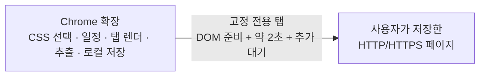

# OpenStill

OpenStill은 사용자가 지정한 웹페이지와 CSS 선택자의 변화를 브라우저 로컬에서 확인하는 Manifest V3 Chrome 확장 프로그램입니다. 선택, 실제 렌더링, 일정, 결과, 백업은 모두 확장 프로그램과 Chrome 로컬 저장소에서 처리합니다.

## 핵심 기능

- 한 URL에 최대 20개 typed locator(CSS, Shadow DOM용 XCSS, XPath, include/exclude, 속성·프로퍼티 필드)를 하나의 추적으로 저장하고, 중복 없는 결과 목록으로 비교
- 리스트·래퍼 변경에 덜 흔들리는 SelectorX가 `:first-child`, 의미 있는 class/attribute 부분 일치, 형제 관계를 조합해 CSS/XCSS를 생성
- 정규식 후처리, 렌더링 추가 대기·최대 캡처 시간, 텍스트/HTML·링크 비교, 공백 무시, 빈 결과 처리, 인라인 스타일·스크립트·HTML 주석 포함을 추적별로 설정
- 변경 다이얼로그에서 안전한 HTTP(S) 링크를 클릭하고, 기준/변경 이력·실행 이력과 선택 실패 당시의 정제된 화면 증거를 확인
- 실시간 감시는 별도의 고정 전용 탭에서 MutationObserver로 연결하며, 실제 캡처·비교는 예약 확인과 같은 경로를 사용. 상주 전용 탭은 최대 12개이며, 연결·대기·복구 상태를 표시
- 초기 캡처는 DOM 준비를 기다린 뒤 **약 2초**와 사용자가 설정한 추가 대기를 적용. 이미지 등 모든 자원의 완전한 로드나 SPA의 최종 상태를 보장하는 대기는 아님
- 예약 확인 중인 탭을 맨 왼쪽의 **고정 파비콘 전용 탭**으로 비활성 상태에서 잠시 열고, 확인이 끝나면 닫음
- 48px 행과 viewport 주변만 표시하는 가상 목록, 현재 화면·검색 결과·전체 추적 선택, 표시/숨김 선택 수와 일괄 작업 결과 요약
- 기본값인 **수동** 확인과 고정 주기·랜덤 주기·Cron 일정·실시간 감시, 변경 알림, 알림음, 라벨·상태·페이지 제목 검색, 게시물 ID·링크 우선 비교와 큰 내용의 부분 표시
- 대시보드의 **주소 일괄 변경**: 도메인(필요하면 포트) 단위로 여러 추적의 주소를 옮기며, 프로토콜·경로·쿼리·확인 방식과 기존 스냅샷·변경·실행 기록을 유지하고 대상 페이지 충돌 시 전체 변경을 안전하게 취소
- 마지막 읽은 시간·확인한 시간·변경된 시간·이름 기준의 오름차순/내림차순 실시간 정렬
- `openstill-export` v5 JSON 가져오기/내보내기(v2·v3·v4도 호환): 최대 **10,000개 추적**. 번호가 붙은 32 MiB 미만 파일, 레코드·봉투·세트 완전성 검사, SHA로 식별한 불변 스냅샷과 추적 참조의 분리 저장, 설정·복구 대기 원본을 포함한 백업
- 손상·누락 파일에서도 완전한 독립 레코드를 먼저 복원하고, 불완전 조각·수리 전 원본·공간 부족 자료는 복구 영역에 보관. 동일 ID와 내용은 중복 등록하지 않으며, 다른 내용의 ID 충돌은 별도로 안내
- 가져오기 워커가 파일을 스트리밍으로 읽고 레코드 저장 확인을 기다리며 진행도를 표시. 복구함에서 보관 파일 처리·누락 파일 추가·부분 복원 재시도·내보내기를 이어가며, 원본·준비 자료·작업 결과를 로컬에 지속 저장

## 구성과 실행 흐름

```mermaid
flowchart LR
  E["Chrome 확장\nCSS 선택 · 일정 · 탭 렌더 · 추출 · 로컬 저장"]
  W["사용자가 저장한\nHTTP/HTTPS 페이지"]
  E -->|"고정 전용 탭\nDOM 준비 + 약 2초 + 추가 대기"| W
```

자동 확인을 켠 추적은 Chrome과 확장이 실행 중일 때 다음 확인 시각에 처리합니다. 수동 추적은 자동으로 갱신하지 않으며, 대시보드의 **지금 확인**으로만 기준값과 변경을 확인합니다.

고정·랜덤 주기는 최소 5초를 표현할 수 있지만, Chrome 알람과 서비스 워커 수명, 페이지 응답 시간에 따라 실제 확인이 늦어질 수 있습니다. 30일 이상의 주기는 자동 실행하지 않는 값으로 취급합니다. 수동·예약·실시간 캡처는 전역 최대 6개, 같은 origin(프로토콜·호스트·포트) 최대 2개의 공통 큐를 사용합니다. 많은 추적에 짧은 주기를 설정해도 모든 주소를 그 주기에 확인한다는 뜻은 아니며, 대시보드에서 진행·대기·재시도·상주 탭 상태를 확인할 수 있습니다.

## 로컬 확장 설치

1. https://github.com/tchinso/OpenStill/releases/ 에서 확장프로그램을 다운로드 합니다.(Source Code.zip)
2. 적당한 경로에 압축을 풉니다.
3. Chrome에서 `chrome://extensions`를 엽니다.
4. **개발자 모드**를 켭니다.
5. **압축해제된 확장 프로그램을 로드합니다**를 눌러 압축이 풀린 저장소의 루트를 선택합니다.
6. HTTP/HTTPS 페이지에서 OpenStill 아이콘을 누르고 **이 페이지에서 요소 선택**을 시작합니다.
7. 원하는 요소를 고른 뒤 이름·라벨·확인 방식을 정하고 저장합니다.

OpenStill은 설치 시 HTTP/HTTPS 전체 사이트 접근 권한을 요청합니다. 이는 사용자가 가져온 수백 개의 임의 도메인을 도메인별 권한 대화상자 없이 예약 확인하기 위해서입니다. 실제로 열고 읽는 대상은 사용자가 저장하거나 가져온 URL과 그 추적에 설정된 CSS 선택자에 한정됩니다.

## 권한

| 권한 | 용도 |
| --- | --- |
| `activeTab`, `scripting` | 사용자가 요청한 현재 탭의 CSS 선택기 |
| required `http://*/*`, `https://*/*` | 저장/가져온 임의 HTTP·HTTPS URL의 예약 확인 |
| `storage`, `unlimitedStorage` | 로컬 설정·작업 상태 및 IndexedDB의 추적·스냅샷·이전본·복구 원본 |
| `alarms`, `notifications` | Chrome가 켜진 동안의 자동 확인과 변경 알림 |
| `offscreen` | 선택자 문법 검증, 시간 제한으로 종료하는 정규식 Worker와 로컬 알림음 |
| `webNavigation` | 사용자가 저장한 하위 프레임 locator를 해당 프레임에만 실행하고, 새로고침 뒤에도 URL 기반 frame 경로로 다시 식별 |
| `tabs` | 저장 URL의 확인·실시간 전용 탭 관리와 확장이 소유한 탭의 복구·정리 |
| `downloads` | 사용자가 요청한 분할 JSON 백업 파일을 저장하고, 그 파일의 완료·실패만 확인 |

OpenStill은 `downloads`를 사용자가 요청한 분할 JSON 백업 파일의 저장과 그 파일의 완료·실패 처리에만 사용하며, 기존 다운로드 목록을 조회하거나 저장하지 않습니다. `cookies`, `history`, `webRequest`, `contextMenus`, 원격 JavaScript/Wasm은 사용하지 않습니다. 관련 없는 탭의 DOM·콘텐츠를 읽거나 저장하지 않으며, 소유권이 불확실한 복원 탭은 URL이 같다는 이유로 닫지 않습니다. 선택기는 저장 대상 페이지의 접근 가능한 프레임에만 패키지의 고정 스크립트를 주입합니다. 쿠키·비밀번호·인증 헤더를 읽거나 로그인·페이월·CAPTCHA를 우회하지 않습니다.

## 데이터와 한계

- URL, 페이지 제목, typed locator, 필터된 스냅샷·이력·일정은 브라우저 로컬 IndexedDB에 레코드별로 저장하고, 설정·알림·일부 작업 상태는 Chrome 로컬 저장소에 저장합니다. 개발자나 제3자 서버로 전송하지 않습니다.
- 스냅샷은 변경하지 않는 자료로 분리 저장하고, 추적별 이전 정상본과 삭제·교체 원본, 마이그레이션·수리 전 원문을 복구 영역에 보관합니다. 추적 삭제는 즉시 모든 원문을 영구 지우는 동작이 아닙니다. 이 내부 복구 자료는 같은 프로필에만 있으며 외부 백업을 대신하지 않습니다.
- 대시보드에서 사용자가 명시적으로 내보내거나 가져오는 JSON 파일로만 데이터를 백업·복원할 수 있습니다.
- 생성되는 각 백업 파일은 32 MiB 미만입니다. 파일 개수만으로 일괄 거부하지 않지만, 독립 JSON 레코드의 해석 예산은 UTF-8 16 MiB, 이전 형식 조각의 조립 예산은 64 MiB입니다. 예산을 넘거나 해석할 수 없는 원본은 보관하고 복구 대기로 안내하며, 끊긴 내용을 추정하여 합성하지 않습니다.
- part 누락·중복·혼합·손상을 진단하며, 세트가 완전하지 않아도 완전한 독립 레코드를 회수합니다. 모든 조각이 필요한 단일 레코드는 조각이 모일 때까지 복구 대기에 남습니다. 이전 백업에서 제공하지 않은 체크섬·마지막 part 정보는 소급해서 증명할 수 없습니다.
- Shadow DOM은 XCSS locator로, 접근 가능한 iframe은 frame locator로 추적할 수 있습니다. 브라우저가 스크립트 주입을 허용하지 않는 sandboxed·보호 프레임은 변경으로 오인하지 않고 확인 오류로 표시됩니다.
- 실시간 감시는 별도 고정 전용 탭에서 동작합니다. 탭 종료·이동·주입 실패·상주 한도 초과 시 연결 또는 복구 대기 상태를 표시하고 가능한 경우 재연결합니다.
- 이미 저장 시 잘린 원문은 지문만으로 복원할 수 없습니다. 저장된 내용의 잘림·생략·관측된 빈 결과를 구분하고, 큰 변경은 부분 표시와 변경 위치 이동으로 확인합니다.
- Chrome/확장이 종료되면 웹페이지 확인은 실행되지 않습니다.
